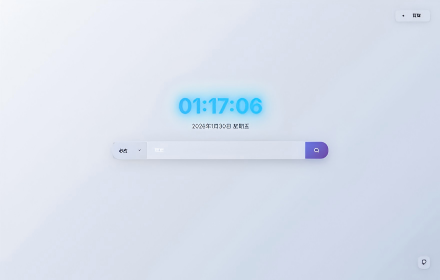
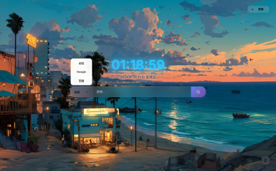

# 琪窦初开 (QidoBloom)

## 项目介绍

琪窦初开（QidoBloom）是一款功能强大的浏览器扩展，为您提供美观、高效的个人导航主页。它不仅是一个简单的书签集合，更是一个全方位的上网入口，集成了快捷访问、搜索引擎管理、个性化分组、壁纸更换等多种功能，让您的网络冲浪体验焕然一新。

  

### 核心特性

- 🎨 **美观界面**：现代化设计，支持自定义壁纸
- 🔍 **多搜索引擎**：集成主流搜索引擎，支持自定义添加
- 📁 **网站分组**：可创建多个分组，分类管理常用网站
- 🌐 **快捷访问**：一键直达常用网站，提高工作效率
- 🎯 **智能搜索**：快速切换搜索引擎，支持键盘快捷键
- 💾 **本地存储**：数据保存在本地，保护隐私安全
- 🖼️ **壁纸管理**：支持自定义壁纸，打造个性化界面
- 📤 **数据导入导出**：支持数据备份和迁移，确保数据安全
- 🚀 **浏览器扩展**：作为浏览器扩展运行，随时访问
- 📌 **随手上收藏**：在任意网页点扩展图标或右键菜单，一键存进指定分组
- 🗂️ **图标本地缓存**：图标存一份在本地，开新标签页不再逐张联网；某个图标源拿不到时自动换另一个源

## 快速开始

### 安装部署

1. **准备扩展**
   - [下载](https://github.com/bayueqi/ZQ-QidoBloom/archive/refs/heads/main.zip)本项目到本地
   - 将文件解压出来

2. **安装到浏览器**
     1. 打开浏览器，访问 `chrome://extensions` 或 `edge://extensions`
     2. 开启「开发者模式」
     3. 点击「加载已解压的扩展程序」
     4. 选择解压出来的文件根目录
     5. 扩展安装完成，可在扩展栏中固定

## 功能使用

### 添加常用网站

1. 点击页面顶部的「管理」按钮
2. 选择「分组管理」
3. 创建新分组或选择现有分组
4. 点击「添加网站」按钮
5. 填写网站名称、URL，系统会自动获取网站图标
6. 点击「保存」按钮完成添加

### 收藏当前网页到分组

看到值得留下的网页时，不用切回起始页：

1. **点扩展图标**：弹出的面板会显示当前网页的标题和地址，选一个分组后「保存到分组」。
   名称可以当场改；分组不存在时点「新建分组」就地创建。
2. **右键菜单**：在页面上右键 →「把当前页面添加到「琪窦初开」」→ 直接选分组；
   在链接上右键则是「把这个链接添加到「琪窦初开」」，存的是链接地址而不是当前页。
   一时拿不准放哪个分组，可以先「先收进「待分组」」，回头再整理。

同一分组里已有相同地址时会提示「已存在」，不会重复添加。通过右键菜单收藏的网站会先记为待归类，
扩展图标上会出现数字角标；下次打开起始页（或点开扩展面板）时会自动并入对应分组并清空角标。

> 浏览器内部页面（`chrome://`、扩展商店等）不允许扩展读取地址，这类页面无法收藏。

### 图标缓存与图标源

起始页的图标默认从图标 API 取。为了不用每次开新标签页都逐张联网，图标会在本地存一份：

- **先翻本地**：存过的图标直接用，一次请求都不发。
- **没存过才联网**：取回后顺手存下，下次直接用。
- **一个源拿不到就换另一个源**：各图标源的覆盖面不一样，某个站在这家没有、在那家有，
  会自动换源再试，拿到就存下来。所以在多个图标源之间切换是安全的。
- **换图标源不会清空已缓存的图标**：缓存按域名存，跟这张图是哪个源抓来的无关。
  想看新源的图标，用设置里的「清空图标缓存」按钮手动清一次即可。
- 30 天后自动重新抓取（免得网站换了 logo 你还看着旧的）。
- 缓存读不出、写不进、抓不到，都静默退回原来的显示方式（站点名首字母），不报错不弹窗。

### 管理搜索引擎

1. 点击页面顶部的「管理」按钮
2. 选择「搜索引擎管理」
3. 在这里可以：
   - 添加新的搜索引擎
   - 编辑现有搜索引擎
   - 删除不需要的搜索引擎
   - 设置默认搜索引擎

### 自定义壁纸

1. 点击页面顶部的「管理」按钮
2. 选择「壁纸管理」
3. 在这里可以：
   - 选择内置壁纸
   - 上传自定义壁纸（支持图片文件）
   - 恢复默认白色背景
   - 实时预览壁纸效果

### 数据导入导出

1. 点击页面顶部的「管理」按钮
2. 选择「数据管理」
3. 在这里可以：
   - **导出数据**：将所有配置导出为JSON文件，用于备份
   - **导入数据**：从JSON文件恢复之前的配置
   - **重置数据**：清空所有数据，恢复到初始状态


## 项目结构

```
├── index.html          # 主页面
├── style.css           # 样式文件
├── script.js           # 核心功能脚本
├── manifest.json       # 浏览器扩展配置文件
├── README.md           # 项目说明文档
└── img                 # 图片资源目录

